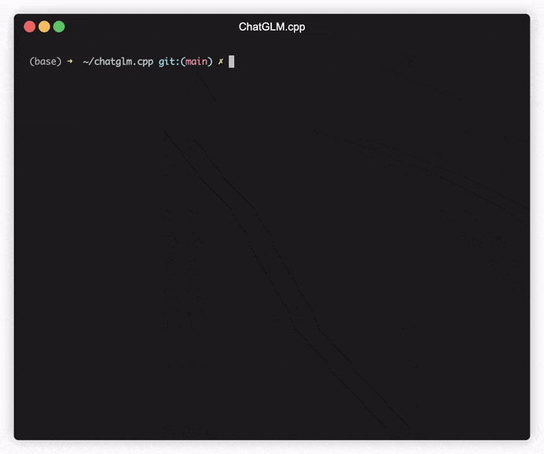
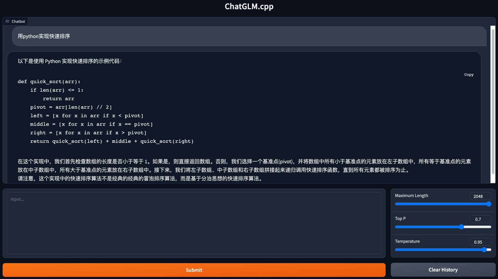

# ChatGLM.cpp

[](https://github.com/li-plus/chatglm.cpp/actions/workflows/cmake.yml)
[](https://github.com/li-plus/chatglm.cpp/actions/workflows/python-package.yml)
[](https://pypi.org/project/chatglm-cpp/)
[](LICENSE)

C++ implementation of [ChatGLM-6B](https://github.com/THUDM/ChatGLM-6B) and [ChatGLM2-6B](https://github.com/THUDM/ChatGLM2-6B) for real-time chatting on your MacBook.



## Features

* [x] Pure C++ implementation based on [ggml](https://github.com/ggerganov/ggml), working in the same way as [llama.cpp](https://github.com/ggerganov/llama.cpp).
* [x] Accelerated memory-efficient CPU inference with int4/int8 quantization, optimized KV cache and parallel computing.
* [x] Streaming generation with typewriter effect.
* [x] Python binding, web demo, and more possibilities.

## Getting Started

**Preparation**

Clone the ChatGLM.cpp repository into your local machine:
```sh
git clone --recursive https://github.com/li-plus/chatglm.cpp.git && cd chatglm.cpp
```

If you forgot the `--recursive` flag when cloning the repository, run the following command in the `chatglm.cpp` folder:
```sh
git submodule update --init --recursive
```

**Quantize Model**

Use `convert.py` to transform ChatGLM-6B or ChatGLM2-6B into quantized GGML format. For example, to convert the fp16 base model to q4_0 (quantized int4) GGML model, run:
```sh
# For ChatGLM-6B
python3 convert.py -i THUDM/chatglm-6b -t q4_0 -o chatglm-ggml.bin
# For ChatGLM2-6B
python3 convert.py -i THUDM/chatglm2-6b -t q4_0 -o chatglm2-ggml.bin
```

You are free to try any of the below quantization types by specifying `-t <type>`:
* `q4_0`: 4-bit integer quantization with fp16 scales.
* `q4_1`: 4-bit integer quantization with fp16 scales and minimum values.
* `q5_0`: 5-bit integer quantization with fp16 scales.
* `q5_1`: 5-bit integer quantization with fp16 scales and minimum values.
* `q8_0`: 8-bit integer quantization with fp16 scales.
* `f16`: half precision floating point weights without quantization.
* `f32`: single precision floating point weights without quantization.

For LoRA model, add `-l <lora_model_name_or_path>` flag to merge your LoRA weights into the base model.

**Build & Run**

Compile the project using CMake:
```sh
cmake -B build
cmake --build build -j
```

Now you may chat with the quantized ChatGLM-6B model by running:
```sh
./build/bin/main -m chatglm-ggml.bin -p 你好                            # ChatGLM-6B
# 你好👋！我是人工智能助手 ChatGLM-6B，很高兴见到你，欢迎问我任何问题。
./build/bin/main -m chatglm2-ggml.bin -p 你好 --top_p 0.8 --temp 0.8    # ChatGLM2-6B
# 你好👋！我是人工智能助手 ChatGLM2-6B，很高兴见到你，欢迎问我任何问题。
```

To run the model in interactive mode, add the `-i` flag. For example:
```sh
./build/bin/main -m chatglm-ggml.bin -i
```
In interactive mode, your chat history will serve as the context for the next-round conversation.

Run `./build/bin/main -h` to explore more options!

## Using BLAS

BLAS library can be integrated to further accelerate matrix multiplication. However, in some cases, using BLAS may cause performance degradation. Whether to turn on BLAS should depend on the benchmarking result.

**Accelerate Framework**

Accelerate Framework is automatically enabled on macOS. To disable it, add the CMake flag `-DGGML_NO_ACCELERATE=ON`.

**OpenBLAS**

OpenBLAS provides acceleration on CPU. Add the CMake flag `-DGGML_OPENBLAS=ON` to enable it.
```sh
cmake -B build -DGGML_OPENBLAS=ON
cmake --build build -j
```

**cuBLAS**

cuBLAS uses NVIDIA GPU to accelerate BLAS. Add the CMake flag `-DGGML_CUBLAS=ON` to enable it.
```sh
cmake -B build -DGGML_CUBLAS=ON
cmake --build build -j
```

Note that the current GGML CUDA implementation is really slow. The community is making efforts to optimize it.

## Python Binding

The Python binding provides high-level `chat` and `stream_chat` interface similar to the original Hugging Face ChatGLM(2)-6B.

Install from PyPI (recommended): will trigger compilation on your platform.
```sh
pip install -U chatglm-cpp
```

To enable cuBLAS acceleration:
```sh
CMAKE_ARGS="-DGGML_CUBLAS=ON" pip install -U chatglm-cpp
```

You may also install from source:
```sh
# install from the latest source hosted on GitHub
pip install git+https://github.com/li-plus/chatglm.cpp.git@main
# or install from your local source after git cloning the repo
pip install .
```

Run the Python example to chat with the quantized model:
```sh
cd examples && python3 cli_chat.py -m ../chatglm-ggml.bin -i
```

You may also launch a web demo to chat in your browser:
```sh
cd examples && python3 web_demo.py -m ../chatglm-ggml.bin
```

For ChatGLM2, change the model path to `../chatglm2-ggml.bin` and everything works fine.



## Using Docker

```sh
docker run -it --rm -v [model path]:/opt/ chulinx/chatglm /chatglm -m /opt/chatglm2-ggml.bin -p "你好啊"
你好👋！我是人工智能助手 ChatGLM2-6B，很高兴见到你，欢迎问我任何问题。
```

## Performance

Environment:
* CPU performance is measured on a Linux server with Intel(R) Xeon(R) Platinum 8260 CPU @ 2.40GHz using 16 threads.
* CUDA performance is measured on a V100-SXM2-32GB GPU using 1 thread.

ChatGLM-6B:

|                 | Q4_0  | Q4_1  | Q5_0  | Q5_1  | Q8_0  | F16   | F32   |
|-----------------|-------|-------|-------|-------|-------|-------|-------|
| ms/token (CPU)  | 74    | 77    | 86    | 89    | 114   | 189   | 357   |
| ms/token (V100) | 10.0  | 9.8   | 10.7  | 10.6  | 14.6  | 19.8  | 34.2  |
| file size       | 3.3GB | 3.7GB | 4.0GB | 4.4GB | 6.2GB | 12GB  | 23GB  |
| mem usage       | 4.0GB | 4.4GB | 4.7GB | 5.1GB | 6.9GB | 13GB  | 24GB  |

ChatGLM2-6B:

|                 | Q4_0  | Q4_1  | Q5_0  | Q5_1  | Q8_0  | F16   | F32   |
|-----------------|-------|-------|-------|-------|-------|-------|-------|
| ms/token (CPU)  | 64    | 71    | 79    | 83    | 106   | 189   | 372   |
| ms/token (V100) | 9.7   | 9.4   | 10.3  | 10.2  | 14.0  | 19.1  | 33.0  |
| file size       | 3.3GB | 3.7GB | 4.0GB | 4.4GB | 6.2GB | 12GB  | 24GB  |
| mem usage       | 3.4GB | 3.8GB | 4.1GB | 4.5GB | 6.2GB | 12GB  | 23GB  |

## Development

* To perform unit tests, add the CMake flag `-DCHATGLM_ENABLE_TESTING=ON`, recompile, and run `./build/bin/chatglm_test`. For benchmark only, run `./build/bin/chatglm_test --gtest_filter=ChatGLM.benchmark`.
* To format the code, run `cmake --build build --target lint`. You should have `clang-format`, `black` and `isort` pre-installed.
* To check performance issue, add the CMake flag `-DGGML_PERF=ON`. It will show timing for each graph operation when running the model.

## Acknowledgements

* This project is greatly inspired by [@ggerganov](https://github.com/ggerganov)'s [llama.cpp](https://github.com/ggerganov/llama.cpp) and is based on his NN library [ggml](https://github.com/ggerganov/ggml).
* Thank [@THUDM](https://github.com/THUDM) for the amazing [ChatGLM-6B](https://github.com/THUDM/ChatGLM-6B) and [ChatGLM2-6B](https://github.com/THUDM/ChatGLM2-6B) and for releasing the model sources and checkpoints.
