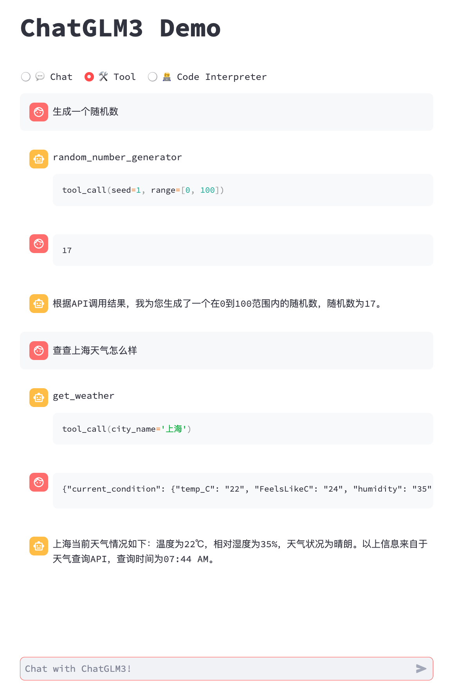
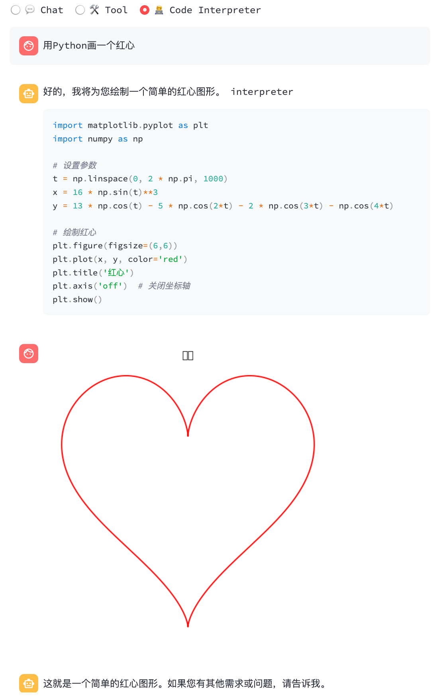

# ChatGLM.cpp

[](https://github.com/li-plus/chatglm.cpp/actions/workflows/cmake.yml)
[](https://github.com/li-plus/chatglm.cpp/actions/workflows/python-package.yml)
[](https://pypi.org/project/chatglm-cpp/)

[](LICENSE)

C++ implementation of [ChatGLM-6B](https://github.com/THUDM/ChatGLM-6B), [ChatGLM2-6B](https://github.com/THUDM/ChatGLM2-6B), [ChatGLM3-6B](https://github.com/THUDM/ChatGLM3) and more LLMs for real-time chatting on your MacBook.


## Features

Highlights:
* Pure C++ implementation based on [ggml](https://github.com/ggerganov/ggml), working in the same way as [llama.cpp](https://github.com/ggerganov/llama.cpp).
* Accelerated memory-efficient CPU inference with int4/int8 quantization, optimized KV cache and parallel computing.
* Streaming generation with typewriter effect.
* Python binding, web demo, api servers and more possibilities.

Support Matrix:
* Hardwares: x86/arm CPU, NVIDIA GPU, Apple Silicon GPU
* Platforms: Linux, MacOS, Windows
* Models: [ChatGLM-6B](https://github.com/THUDM/ChatGLM-6B), [ChatGLM2-6B](https://github.com/THUDM/ChatGLM2-6B), [ChatGLM3-6B](https://github.com/THUDM/ChatGLM3), [CodeGeeX2](https://github.com/THUDM/CodeGeeX2), [Baichuan-13B](https://github.com/baichuan-inc/Baichuan-13B), [Baichuan-7B](https://github.com/baichuan-inc/Baichuan-7B), [Baichuan-13B](https://github.com/baichuan-inc/Baichuan-13B), [Baichuan2](https://github.com/baichuan-inc/Baichuan2), [InternLM](https://github.com/InternLM/InternLM)

## Getting Started

**Preparation**

Clone the ChatGLM.cpp repository into your local machine:
```sh
git clone --recursive https://github.com/li-plus/chatglm.cpp.git && cd chatglm.cpp
```

If you forgot the `--recursive` flag when cloning the repository, run the following command in the `chatglm.cpp` folder:
```sh
git submodule update --init --recursive
```

**Quantize Model**

Install necessary packages for loading and quantizing Hugging Face models:
```sh
python3 -m pip install -U pip
python3 -m pip install torch tabulate tqdm transformers accelerate sentencepiece
```

Use `convert.py` to transform ChatGLM-6B into quantized GGML format. For example, to convert the fp16 original model to q4_0 (quantized int4) GGML model, run:
```sh
python3 chatglm_cpp/convert.py -i THUDM/chatglm-6b -t q4_0 -o chatglm-ggml.bin
```

The original model (`-i <model_name_or_path>`) can be a Hugging Face model name or a local path to your pre-downloaded model. Currently supported models are:
* ChatGLM-6B: `THUDM/chatglm-6b`, `THUDM/chatglm-6b-int8`, `THUDM/chatglm-6b-int4`
* ChatGLM2-6B: `THUDM/chatglm2-6b`, `THUDM/chatglm2-6b-int4`
* ChatGLM3-6B: `THUDM/chatglm3-6b`
* CodeGeeX2: `THUDM/codegeex2-6b`, `THUDM/codegeex2-6b-int4`
* Baichuan & Baichuan2: `baichuan-inc/Baichuan-13B-Chat`, `baichuan-inc/Baichuan2-7B-Chat`, `baichuan-inc/Baichuan2-13B-Chat`

You are free to try any of the below quantization types by specifying `-t <type>`:
* `q4_0`: 4-bit integer quantization with fp16 scales.
* `q4_1`: 4-bit integer quantization with fp16 scales and minimum values.
* `q5_0`: 5-bit integer quantization with fp16 scales.
* `q5_1`: 5-bit integer quantization with fp16 scales and minimum values.
* `q8_0`: 8-bit integer quantization with fp16 scales.
* `f16`: half precision floating point weights without quantization.
* `f32`: single precision floating point weights without quantization.

For LoRA model, add `-l <lora_model_name_or_path>` flag to merge your LoRA weights into the base model.

**Build & Run**

Compile the project using CMake:
```sh
cmake -B build
cmake --build build -j --config Release
```

Now you may chat with the quantized ChatGLM-6B model by running:
```sh
./build/bin/main -m chatglm-ggml.bin -p 你好
# 你好👋！我是人工智能助手 ChatGLM-6B，很高兴见到你，欢迎问我任何问题。
```

To run the model in interactive mode, add the `-i` flag. For example:
```sh
./build/bin/main -m chatglm-ggml.bin -i
```
In interactive mode, your chat history will serve as the context for the next-round conversation.

Run `./build/bin/main -h` to explore more options!

**Try Other Models**

<details open>
<summary>ChatGLM2-6B</summary>

```sh
python3 chatglm_cpp/convert.py -i THUDM/chatglm2-6b -t q4_0 -o chatglm2-ggml.bin
./build/bin/main -m chatglm2-ggml.bin -p 你好 --top_p 0.8 --temp 0.8
# 你好👋！我是人工智能助手 ChatGLM2-6B，很高兴见到你，欢迎问我任何问题。
```
</details>

<details open>
<summary>ChatGLM3-6B</summary>

ChatGLM3-6B further supports function call and code interpreter in addition to chat mode.

Chat mode:
```sh
python3 chatglm_cpp/convert.py -i THUDM/chatglm3-6b -t q4_0 -o chatglm3-ggml.bin
./build/bin/main -m chatglm3-ggml.bin -p 你好 --top_p 0.8 --temp 0.8
# 你好👋！我是人工智能助手 ChatGLM3-6B，很高兴见到你，欢迎问我任何问题。
```

Setting system prompt:
```sh
./build/bin/main -m chatglm3-ggml.bin -p 你好 -s "You are ChatGLM3, a large language model trained by Zhipu.AI. Follow the user's instructions carefully. Respond using markdown."
# 你好👋！我是 ChatGLM3，有什么问题可以帮您解答吗？
```

Function call:
~~~
$ ./build/bin/main -m chatglm3-ggml.bin --top_p 0.8 --temp 0.8 --sp examples/system/function_call.txt -i
System   > Answer the following questions as best as you can. You have access to the following tools: ...
Prompt   > 生成一个随机数
ChatGLM3 > random_number_generator
```python
tool_call(seed=42, range=(0, 100))
```
Tool Call   > Please manually call function `random_number_generator` with args `tool_call(seed=42, range=(0, 100))` and provide the results below.
Observation > 23
ChatGLM3 > 根据您的要求，我使用随机数生成器API生成了一个随机数。根据API返回结果，生成的随机数为23。
~~~

Code interpreter:
~~~
$ ./build/bin/main -m chatglm3-ggml.bin --top_p 0.8 --temp 0.8 --sp examples/system/code_interpreter.txt -i
System   > 你是一位智能AI助手，你叫ChatGLM，你连接着一台电脑，但请注意不能联网。在使用Python解决任务时，你可以运行代码并得到结果，如果运行结果有错误，你需要尽可能对代码进行改进。你可以处理用户上传到电脑上的文件，文件默认存储路径是/mnt/data/。
Prompt   > 列出100以内的所有质数
ChatGLM3 > 好的，我会为您列出100以内的所有质数。
```python
def is_prime(n):
   """Check if a number is prime."""
   if n <= 1:
       return False
   if n <= 3:
       return True
   if n % 2 == 0 or n % 3 == 0:
       return False
   i = 5
   while i * i <= n:
       if n % i == 0 or n % (i + 2) == 0:
           return False
       i += 6
   return True

primes_upto_100 = [i for i in range(2, 101) if is_prime(i)]
primes_upto_100
```

Code Interpreter > Please manually run the code and provide the results below.
Observation      > [2, 3, 5, 7, 11, 13, 17, 19, 23, 29, 31, 37, 41, 43, 47, 53, 59, 61, 67, 71, 73, 79, 83, 89, 97]
ChatGLM3 > 100以内的所有质数为：

$$
2, 3, 5, 7, 11, 13, 17, 19, 23, 29, 31, 37, 41, 43, 47, 53, 59, 61, 67, 71, 73, 79, 83, 89, 97 
$$
~~~

</details>

<details>
<summary>CodeGeeX2</summary>

```sh
$ python3 chatglm_cpp/convert.py -i THUDM/codegeex2-6b -t q4_0 -o codegeex2-ggml.bin
$ ./build/bin/main -m codegeex2-ggml.bin --temp 0 --mode generate -p "\
# language: Python
# write a bubble sort function
"


def bubble_sort(list):
    for i in range(len(list) - 1):
        for j in range(len(list) - 1):
            if list[j] > list[j + 1]:
                list[j], list[j + 1] = list[j + 1], list[j]
    return list


print(bubble_sort([5, 4, 3, 2, 1]))
```
</details>

<details>
<summary>Baichuan-13B-Chat</summary>

```sh
python3 chatglm_cpp/convert.py -i baichuan-inc/Baichuan-13B-Chat -t q4_0 -o baichuan-13b-chat-ggml.bin
./build/bin/main -m baichuan-13b-chat-ggml.bin -p 你好 --top_k 5 --top_p 0.85 --temp 0.3 --repeat_penalty 1.1
# 你好！有什么我可以帮助你的吗？
```
</details>

<details>
<summary>Baichuan2-7B-Chat</summary>

```sh
python3 chatglm_cpp/convert.py -i baichuan-inc/Baichuan2-7B-Chat -t q4_0 -o baichuan2-7b-chat-ggml.bin
./build/bin/main -m baichuan2-7b-chat-ggml.bin -p 你好 --top_k 5 --top_p 0.85 --temp 0.3 --repeat_penalty 1.05
# 你好！很高兴为您提供帮助。请问有什么问题我可以帮您解答？
```
</details>

<details>
<summary>Baichuan2-13B-Chat</summary>

```sh
python3 chatglm_cpp/convert.py -i baichuan-inc/Baichuan2-13B-Chat -t q4_0 -o baichuan2-13b-chat-ggml.bin
./build/bin/main -m baichuan2-13b-chat-ggml.bin -p 你好 --top_k 5 --top_p 0.85 --temp 0.3 --repeat_penalty 1.05
# 你好！今天我能为您提供什么帮助？
```
</details>

<details>
<summary>InternLM-Chat-7B</summary>

```sh
python3 chatglm_cpp/convert.py -i internlm/internlm-chat-7b-v1_1 -t q4_0 -o internlm-chat-7b-ggml.bin
./build/bin/main -m internlm-chat-7b-ggml.bin -p 你好 --top_p 0.8 --temp 0.8
# 你好，我是书生·浦语，有什么可以帮助你的吗？
```
</details>

<details>
<summary>InternLM-Chat-20B</summary>

```sh
python3 chatglm_cpp/convert.py -i internlm/internlm-chat-20b -t q4_0 -o internlm-chat-20b-ggml.bin
./build/bin/main -m internlm-chat-20b-ggml.bin -p 你好 --top_p 0.8 --temp 0.8
# 你好！有什么我可以帮到你的吗？
```
</details>

## Using BLAS

BLAS library can be integrated to further accelerate matrix multiplication. However, in some cases, using BLAS may cause performance degradation. Whether to turn on BLAS should depend on the benchmarking result.

**Accelerate Framework**

Accelerate Framework is automatically enabled on macOS. To disable it, add the CMake flag `-DGGML_NO_ACCELERATE=ON`.

**OpenBLAS**

OpenBLAS provides acceleration on CPU. Add the CMake flag `-DGGML_OPENBLAS=ON` to enable it.
```sh
cmake -B build -DGGML_OPENBLAS=ON && cmake --build build -j
```

**cuBLAS**

cuBLAS uses NVIDIA GPU to accelerate BLAS. Add the CMake flag `-DGGML_CUBLAS=ON` to enable it.
```sh
cmake -B build -DGGML_CUBLAS=ON && cmake --build build -j
```

By default, all kernels will be compiled for all possible CUDA architectures and it takes some time. To run on a specific type of device, you may specify `CUDA_ARCHITECTURES` to speed up the nvcc compilation. For example:
```sh
cmake -B build -DGGML_CUBLAS=ON -DCUDA_ARCHITECTURES="80"       # for A100
cmake -B build -DGGML_CUBLAS=ON -DCUDA_ARCHITECTURES="70;75"    # compatible with both V100 and T4
```

**Metal**

MPS (Metal Performance Shaders) allows computation to run on powerful Apple Silicon GPU. Add the CMake flag `-DGGML_METAL=ON` to enable it.
```sh
cmake -B build -DGGML_METAL=ON && cmake --build build -j
```

## Python Binding

The Python binding provides high-level `chat` and `stream_chat` interface similar to the original Hugging Face ChatGLM(2)-6B.

**Installation**

Install from PyPI (recommended): will trigger compilation on your platform.
```sh
pip install -U chatglm-cpp
```

To enable cuBLAS acceleration on NVIDIA GPU:
```sh
CMAKE_ARGS="-DGGML_CUBLAS=ON" pip install -U chatglm-cpp
```

To enable Metal on Apple silicon devices:
```sh
CMAKE_ARGS="-DGGML_METAL=ON" pip install -U chatglm-cpp
```

You may also install from source. Add the corresponding `CMAKE_ARGS` for acceleration.
```sh
# install from the latest source hosted on GitHub
pip install git+https://github.com/li-plus/chatglm.cpp.git@main
# or install from your local source after git cloning the repo
pip install .
```

Pre-built wheels for CPU backend on Linux / MacOS / Windows are published on [release](https://github.com/li-plus/chatglm.cpp/releases). For CUDA / Metal backends, please compile from source code or source distribution.

**Using Pre-converted GGML Models**

Here is a simple demo that uses `chatglm_cpp.Pipeline` to load the GGML model and chat with it. First enter the examples folder (`cd examples`) and launch a Python interactive shell:
```python
>>> import chatglm_cpp
>>> 
>>> pipeline = chatglm_cpp.Pipeline("../chatglm-ggml.bin")
>>> pipeline.chat([chatglm_cpp.ChatMessage(role="user", content="你好")])
ChatMessage(role="assistant", content="你好👋！我是人工智能助手 ChatGLM-6B，很高兴见到你，欢迎问我任何问题。", tool_calls=[])
```

To chat in stream, run the below Python example:
```sh
python3 cli_demo.py -m ../chatglm-ggml.bin -i
```

Launch a web demo to chat in your browser:
```sh
python3 web_demo.py -m ../chatglm-ggml.bin
```


For other models:

<details open>
<summary>ChatGLM2-6B</summary>

```sh
python3 cli_demo.py -m ../chatglm2-ggml.bin -p 你好 --temp 0.8 --top_p 0.8  # CLI demo
python3 web_demo.py -m ../chatglm2-ggml.bin --temp 0.8 --top_p 0.8  # web demo
```
</details>

<details open>
<summary>ChatGLM3-6B</summary>

**CLI Demo**

Chat mode:
```sh
python3 cli_demo.py -m ../chatglm3-ggml.bin -p 你好 --temp 0.8 --top_p 0.8
```

Function call:
```sh
python3 cli_demo.py -m ../chatglm3-ggml.bin --temp 0.8 --top_p 0.8 --sp system/function_call.txt -i
```

Code interpreter:
```sh
python3 cli_demo.py -m ../chatglm3-ggml.bin --temp 0.8 --top_p 0.8 --sp system/code_interpreter.txt -i
```

**Web Demo**

Install Python dependencies and the IPython kernel for code interpreter.
```sh
pip install streamlit jupyter_client ipython ipykernel
ipython kernel install --name chatglm3-demo --user
```

Launch the web demo:
```sh
streamlit run chatglm3_demo.py
```

| Function Call               | Code Interpreter               |
|-----------------------------|--------------------------------|
|  |  |

</details>

<details>
<summary>CodeGeeX2</summary>

```sh
# CLI demo
python3 cli_demo.py -m ../codegeex2-ggml.bin --temp 0 --mode generate -p "\
# language: Python
# write a bubble sort function
"
# web demo
python3 web_demo.py -m ../codegeex2-ggml.bin --temp 0 --max_length 512 --mode generate --plain
```
</details>

<details>
<summary>Baichuan-13B-Chat</summary>

```sh
python3 cli_demo.py -m ../baichuan-13b-chat-ggml.bin -p 你好 --top_k 5 --top_p 0.85 --temp 0.3 --repeat_penalty 1.1 # CLI demo
python3 web_demo.py -m ../baichuan-13b-chat-ggml.bin --top_k 5 --top_p 0.85 --temp 0.3 --repeat_penalty 1.1   # web demo
```
</details>

<details>
<summary>Baichuan2-7B-Chat</summary>

```sh
python3 cli_demo.py -m ../baichuan2-7b-chat-ggml.bin -p 你好 --top_k 5 --top_p 0.85 --temp 0.3 --repeat_penalty 1.05 # CLI demo
python3 web_demo.py -m ../baichuan2-7b-chat-ggml.bin --top_k 5 --top_p 0.85 --temp 0.3 --repeat_penalty 1.05   # web demo
```
</details>

<details>
<summary>Baichuan2-13B-Chat</summary>

```sh
python3 cli_demo.py -m ../baichuan2-13b-chat-ggml.bin -p 你好 --top_k 5 --top_p 0.85 --temp 0.3 --repeat_penalty 1.05 # CLI demo
python3 web_demo.py -m ../baichuan2-13b-chat-ggml.bin --top_k 5 --top_p 0.85 --temp 0.3 --repeat_penalty 1.05   # web demo
```
</details>

<details>
<summary>InternLM-Chat-7B</summary>

```sh
python3 cli_demo.py -m ../internlm-chat-7b-ggml.bin -p 你好 --top_p 0.8 --temp 0.8  # CLI demo
python3 web_demo.py -m ../internlm-chat-7b-ggml.bin --top_p 0.8 --temp 0.8  # web demo
```
</details>

<details>
<summary>InternLM-Chat-20B</summary>

```sh
python3 cli_demo.py -m ../internlm-chat-20b-ggml.bin -p 你好 --top_p 0.8 --temp 0.8 # CLI demo
python3 web_demo.py -m ../internlm-chat-20b-ggml.bin --top_p 0.8 --temp 0.8 # web demo
```
</details>

**Converting Hugging Face LLMs at Runtime**

Sometimes it might be inconvenient to convert and save the intermediate GGML models beforehand. Here is an option to directly load from the original Hugging Face model, quantize it into GGML models in a minute, and start serving. All you need is to replace the GGML model path with the Hugging Face model name or path.
```python
>>> import chatglm_cpp
>>> 
>>> pipeline = chatglm_cpp.Pipeline("THUDM/chatglm-6b", dtype="q4_0")
Loading checkpoint shards: 100%|██████████████████████████████████| 8/8 [00:10<00:00,  1.27s/it]
Processing model states: 100%|████████████████████████████████| 339/339 [00:23<00:00, 14.73it/s]
...
>>> pipeline.chat([chatglm_cpp.ChatMessage(role="user", content="你好")])
ChatMessage(role="assistant", content="你好👋！我是人工智能助手 ChatGLM-6B，很高兴见到你，欢迎问我任何问题。", tool_calls=[])
```

Likewise, replace the GGML model path with Hugging Face model in any example script, and it just works. For example:
```sh
python3 cli_demo.py -m THUDM/chatglm-6b -p 你好 -i
```

## API Server

We support various kinds of API servers to integrate with popular frontends. Extra dependencies can be installed by:
```sh
pip install 'chatglm-cpp[api]'
```
Remember to add the corresponding `CMAKE_ARGS` to enable acceleration.

**LangChain API**

Start the api server for LangChain:
```sh
MODEL=./chatglm2-ggml.bin uvicorn chatglm_cpp.langchain_api:app --host 127.0.0.1 --port 8000
```

Test the api endpoint with `curl`:
```sh
curl http://127.0.0.1:8000 -H 'Content-Type: application/json' -d '{"prompt": "你好"}'
```

Run with LangChain:
```python
>>> from langchain.llms import ChatGLM
>>> 
>>> llm = ChatGLM(endpoint_url="http://127.0.0.1:8000")
>>> llm.predict("你好")
'你好👋！我是人工智能助手 ChatGLM2-6B，很高兴见到你，欢迎问我任何问题。'
```

For more options, please refer to [examples/langchain_client.py](examples/langchain_client.py) and [LangChain ChatGLM Integration](https://python.langchain.com/docs/integrations/llms/chatglm).

**OpenAI API**

Start an API server compatible with [OpenAI chat completions protocol](https://platform.openai.com/docs/api-reference/chat):
```sh
MODEL=./chatglm2-ggml.bin uvicorn chatglm_cpp.openai_api:app --host 127.0.0.1 --port 8000
```

Test your endpoint with `curl`:
```sh
curl http://127.0.0.1:8000/v1/chat/completions -H 'Content-Type: application/json' \
    -d '{"messages": [{"role": "user", "content": "你好"}]}'
```

Use the OpenAI client to chat with your model:
```python
>>> import openai
>>> 
>>> openai.api_base = "http://127.0.0.1:8000/v1"
>>> response = openai.ChatCompletion.create(model="default-model", messages=[{"role": "user", "content": "你好"}])
>>> response["choices"][0]["message"]["content"]
'你好👋！我是人工智能助手 ChatGLM2-6B，很高兴见到你，欢迎问我任何问题。'
```

For stream response, check out the example client script:
```sh
OPENAI_API_BASE=http://127.0.0.1:8000/v1 python3 examples/openai_client.py --stream --prompt 你好
```

With this API server as backend, ChatGLM.cpp models can be seamlessly integrated into any frontend that uses OpenAI-style API, including [mckaywrigley/chatbot-ui](https://github.com/mckaywrigley/chatbot-ui), [fuergaosi233/wechat-chatgpt](https://github.com/fuergaosi233/wechat-chatgpt), [Yidadaa/ChatGPT-Next-Web](https://github.com/Yidadaa/ChatGPT-Next-Web), and more.

## Using Docker

**Option 1: Building Locally**

Building docker image locally and start a container to run inference on CPU:
```sh
docker build . --network=host -t chatglm.cpp
# cpp demo
docker run -it --rm -v $PWD:/opt chatglm.cpp ./build/bin/main -m /opt/chatglm-ggml.bin -p "你好"
# python demo
docker run -it --rm -v $PWD:/opt chatglm.cpp python3 examples/cli_demo.py -m /opt/chatglm-ggml.bin -p "你好"
# langchain api server
docker run -it --rm -v $PWD:/opt -p 8000:8000 -e MODEL=/opt/chatglm-ggml.bin chatglm.cpp \
    uvicorn chatglm_cpp.langchain_api:app --host 0.0.0.0 --port 8000
# openai api server
docker run -it --rm -v $PWD:/opt -p 8000:8000 -e MODEL=/opt/chatglm-ggml.bin chatglm.cpp \
    uvicorn chatglm_cpp.openai_api:app --host 0.0.0.0 --port 8000
```

For CUDA support, make sure [nvidia-docker](https://github.com/NVIDIA/nvidia-docker) is installed. Then run:
```sh
docker build . --network=host -t chatglm.cpp-cuda \
    --build-arg BASE_IMAGE=nvidia/cuda:12.2.0-devel-ubuntu20.04 \
    --build-arg CMAKE_ARGS="-DGGML_CUBLAS=ON"
docker run -it --rm --gpus all -v $PWD:/chatglm.cpp/models chatglm.cpp-cuda ./build/bin/main -m models/chatglm-ggml.bin -p "你好"
```

**Option 2: Using Pre-built Image**

The pre-built image for CPU inference is published on both [Docker Hub](https://hub.docker.com/repository/docker/liplusx/chatglm.cpp) and [GitHub Container Registry (GHCR)](https://github.com/li-plus/chatglm.cpp/pkgs/container/chatglm.cpp).

To pull from Docker Hub and run demo:
```sh
docker run -it --rm -v $PWD:/opt liplusx/chatglm.cpp:main \
    ./build/bin/main -m /opt/chatglm-ggml.bin -p "你好"
```

To pull from GHCR and run demo:
```sh
docker run -it --rm -v $PWD:/opt ghcr.io/li-plus/chatglm.cpp:main \
    ./build/bin/main -m /opt/chatglm-ggml.bin -p "你好"
```

Python demo and API servers are also supported in pre-built image. Use it in the same way as **Option 1**.

## Performance

Environment:
* CPU backend performance is measured on a Linux server with Intel(R) Xeon(R) Platinum 8260 CPU @ 2.40GHz using 16 threads.
* CUDA backend is measured on a V100-SXM2-32GB GPU using 1 thread.
* MPS backend is measured on an Apple M2 Ultra device using 1 thread.

ChatGLM-6B:

|                                | Q4_0  | Q4_1  | Q5_0  | Q5_1  | Q8_0  | F16   |
|--------------------------------|-------|-------|-------|-------|-------|-------|
| ms/token (CPU @ Platinum 8260) | 74    | 77    | 86    | 89    | 114   | 189   |
| ms/token (CUDA @ V100 SXM2)    | 8.1   | 8.7   | 9.4   | 9.5   | 12.0  | 19.1  |
| ms/token (MPS @ M2 Ultra)      | 11.5  | 12.3  | N/A   | N/A   | 16.1  | 24.4  |
| file size                      | 3.3G  | 3.7G  | 4.0G  | 4.4G  | 6.2G  | 12G   |
| mem usage                      | 4.0G  | 4.4G  | 4.7G  | 5.1G  | 6.9G  | 13G   |

ChatGLM2-6B / ChatGLM3-6B / CodeGeeX2:

|                                | Q4_0  | Q4_1  | Q5_0  | Q5_1  | Q8_0  | F16   |
|--------------------------------|-------|-------|-------|-------|-------|-------|
| ms/token (CPU @ Platinum 8260) | 64    | 71    | 79    | 83    | 106   | 189   |
| ms/token (CUDA @ V100 SXM2)    | 7.9   | 8.3   | 9.2   | 9.2   | 11.7  | 18.5  |
| ms/token (MPS @ M2 Ultra)      | 10.0  | 10.8  | N/A   | N/A   | 14.5  | 22.2  |
| file size                      | 3.3G  | 3.7G  | 4.0G  | 4.4G  | 6.2G  | 12G   |
| mem usage                      | 3.4G  | 3.8G  | 4.1G  | 4.5G  | 6.2G  | 12G   |

Baichuan-7B / Baichuan2-7B:

|                                | Q4_0  | Q4_1  | Q5_0  | Q5_1  | Q8_0  | F16   |
|--------------------------------|-------|-------|-------|-------|-------|-------|
| ms/token (CPU @ Platinum 8260) | 85.3  | 94.8  | 103.4 | 109.6 | 136.8 | 248.5 |
| ms/token (CUDA @ V100 SXM2)    | 8.7   | 9.2   | 10.2  | 10.3  | 13.2  | 21.0  |
| ms/token (MPS @ M2 Ultra)      | 11.3  | 12.0  | N/A   | N/A   | 16.4  | 25.6  |
| file size                      | 4.0G  | 4.4G  | 4.9G  | 5.3G  | 7.5G  | 14G   |
| mem usage                      | 4.5G  | 4.9G  | 5.3G  | 5.7G  | 7.8G  | 14G   |

Baichuan-13B / Baichuan2-13B:

|                                | Q4_0  | Q4_1  | Q5_0  | Q5_1  | Q8_0  | F16   |
|--------------------------------|-------|-------|-------|-------|-------|-------|
| ms/token (CPU @ Platinum 8260) | 161.7 | 175.8 | 189.9 | 192.3 | 255.6 | 459.6 |
| ms/token (CUDA @ V100 SXM2)    | 13.7  | 15.1  | 16.3  | 16.9  | 21.9  | 36.8  |
| ms/token (MPS @ M2 Ultra)      | 18.2  | 18.8  | N/A   | N/A   | 27.2  | 44.4  |
| file size                      | 7.0G  | 7.8G  | 8.5G  | 9.3G  | 14G   | 25G   |
| mem usage                      | 7.8G  | 8.8G  | 9.5G  | 10G   | 14G   | 25G   |

InternLM-7B:

|                                | Q4_0  | Q4_1  | Q5_0  | Q5_1  | Q8_0  | F16   |
|--------------------------------|-------|-------|-------|-------|-------|-------|
| ms/token (CPU @ Platinum 8260) | 85.3  | 90.1  | 103.5 | 112.5 | 137.3 | 232.2 |
| ms/token (CUDA @ V100 SXM2)    | 9.1   | 9.4   | 10.5  | 10.5  | 13.3  | 21.1  |

InternLM-20B:

|                                | Q4_0  | Q4_1  | Q5_0  | Q5_1  | Q8_0  | F16   |
|--------------------------------|-------|-------|-------|-------|-------|-------|
| ms/token (CPU @ Platinum 8260) | 230.0 | 236.7 | 276.6 | 290.6 | 357.1 | N/A   |
| ms/token (CUDA @ V100 SXM2)    | 21.6  | 23.2  | 25.0  | 25.9  | 33.4  | N/A   |

## Development

**Unit Test & Benchmark**

To perform unit tests, add this CMake flag `-DCHATGLM_ENABLE_TESTING=ON` to enable testing. Recompile and run the unit test (including benchmark).
```sh
mkdir -p build && cd build
cmake .. -DCHATGLM_ENABLE_TESTING=ON && make -j
./bin/chatglm_test
```

For benchmark only:
```sh
./bin/chatglm_test --gtest_filter='Benchmark.*'
```

**Lint**

To format the code, run `make lint` inside the `build` folder. You should have `clang-format`, `black` and `isort` pre-installed.

**Performance**

To detect the performance bottleneck, add the CMake flag `-DGGML_PERF=ON`:
```sh
cmake .. -DGGML_PERF=ON && make -j
```
This will print timing for each graph operation when running the model.

## Acknowledgements

* This project is greatly inspired by [@ggerganov](https://github.com/ggerganov)'s [llama.cpp](https://github.com/ggerganov/llama.cpp) and is based on his NN library [ggml](https://github.com/ggerganov/ggml).
* Thank [@THUDM](https://github.com/THUDM) for the amazing [ChatGLM-6B](https://github.com/THUDM/ChatGLM-6B), [ChatGLM2-6B](https://github.com/THUDM/ChatGLM2-6B) and [ChatGLM3-6B](https://github.com/THUDM/ChatGLM3) and for releasing the model sources and checkpoints.
